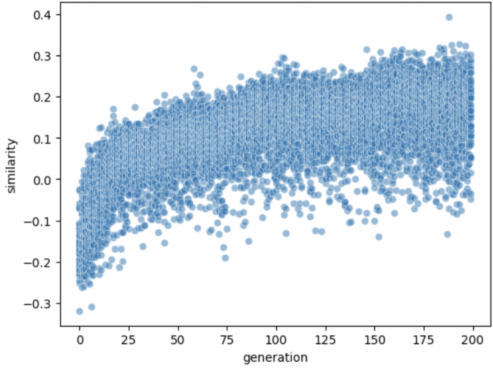

Generate synthesizer sounds from text prompts with a simple evolutionary algorithm.

Audio examples here:

Synth used : https://github.com/torchsynth/torchsynth

Audio-Text cross modal embedding: https://github.com/LAION-AI/CLAP

##  How it works
Start with randomly initialized synthesizer sounds. Each iteration, the current synthesizer sounds are evaluated on how well they match the text prompt. The best sounds are then combined and mutated to generate new sounds for the next iteration. 200 generations w/ 50 samples takes about ~20s on a 3090 (not tested on CPU).

<!-- Text-audio cosine similarity to prompt over generations -->

## Future work

- Install guide / requirements.txt
- Diversity preservation.
- Open ended exploration.
- RL
- Neural nets?
- vst support.
- Chatbot or smth
- NFT
- VR
- VST?
